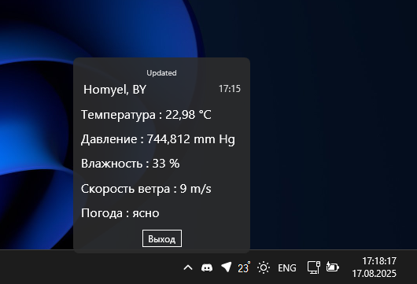

## WeatherBar

Tired of opening your browser every time you want to check today’s weather?  

**WeatherBar** is a simple C# application that displays the current weather directly in your area, making it quick and convenient to stay informed.  

This project demonstrates working with APIs, real-time data, and building small, practical desktop applications in C#.

## Examples

